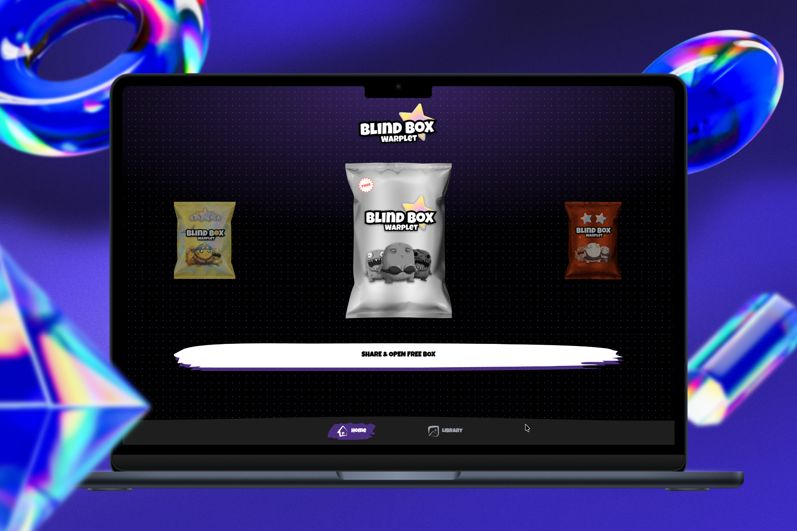
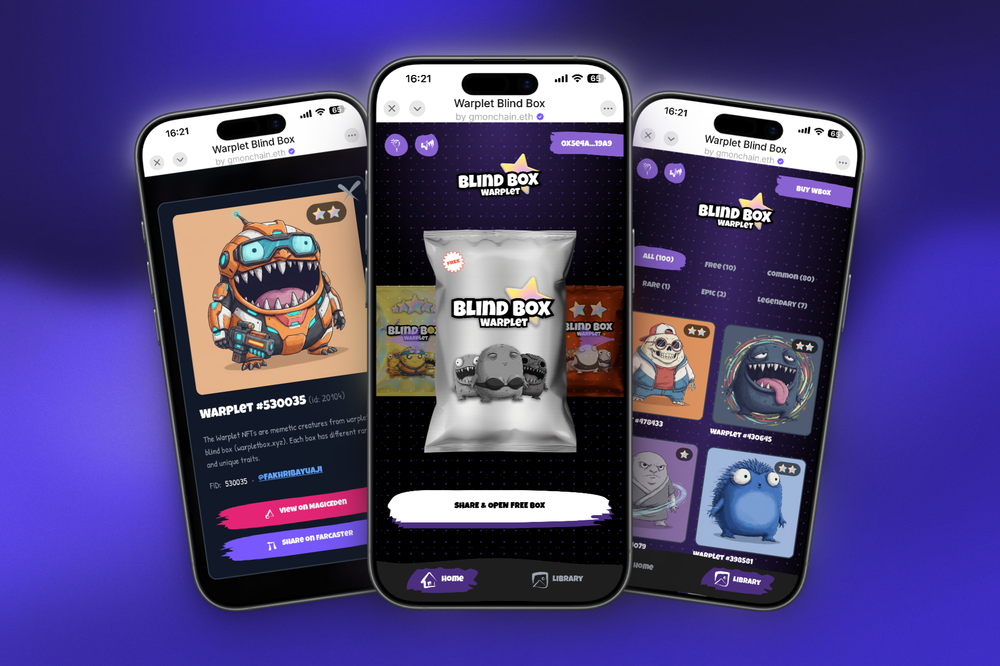
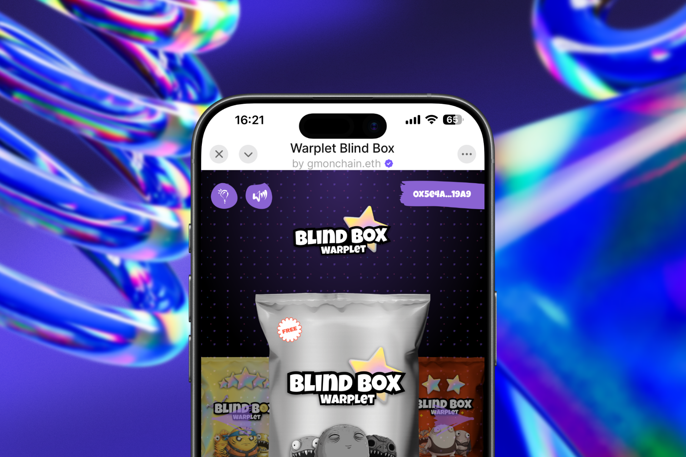

# Warplet Blind Box

**Open mystery boxes and collect unique Warplet NFTs on Base network**

Warplet Blind Box brings the excitement of mystery NFT collecting to Farcaster. Experience the thrill of opening digital treasure chests containing rare and unique Warplet NFTs, all powered by the efficient Base network.

## Screenshots

<table style="width:100%">
  <tr>
    <td style="width:50%; text-align:center;">
      
    </td>
    <td style="width:50%; text-align:center;">
      
    </td>
  </tr>
</table>

## What is Warplet Blind Box?

Warplet Blind Box is an innovative NFT collection miniapp that combines the excitement of mystery boxes with blockchain technology. Users can purchase and open digital blind boxes containing randomly distributed Warplet NFTs of varying rarity levels.

## Key Features

*   **Mystery Box Opening**: Experience the thrill of opening blind boxes with unpredictable NFT rewards
*   **Warplet NFT Collection**: Collect unique digital Warplets with different rarities and attributes
*   **Base Network Integration**: Fast, low-cost transactions on Ethereum's Layer 2 solution
*   **Farcaster Integration**: Seamless social experience within the Farcaster ecosystem
*   **Real-time Updates**: Instant notifications and updates on your collection status
*   **Community Features**: Share your rare finds and compete with other collectors

## How It Works

1. **Connect Your Wallet**: Link your Ethereum-compatible wallet to the miniapp
2. **Purchase Blind Boxes**: Buy mystery boxes using ETH or other supported tokens
3. **Open Your Boxes**: Click to reveal your Warplet NFT - each box contains one random NFT
4. **Build Your Collection**: Collect multiple Warplets and discover rare variants
5. **Trade & Share**: Showcase your collection within the Farcaster community

## NFT Rarity System

Warplet Blind Box features multiple rarity tiers:

*   **Common**: Standard Warplets with basic attributes
*   **Rare**: Enhanced Warplets with special traits
*   **Epic**: Powerful Warplets with unique abilities
*   **Legendary**: Ultra-rare Warplets with exclusive features

## Base Network Benefits

Built on Base, Warplet Blind Box offers:
- Lightning-fast transactions
- Ultra-low gas fees
- Ethereum security and compatibility
- Seamless cross-chain functionality

## Farcaster Mini App

Experience Warplet Blind Box directly on Farcaster: [Warplet Blind Box Miniapp](https://farcaster.xyz/miniapps/j7DqYWYBcmR2/warplet-blind-box)

Join the community of Warplet collectors and start your mystery box adventure today!
